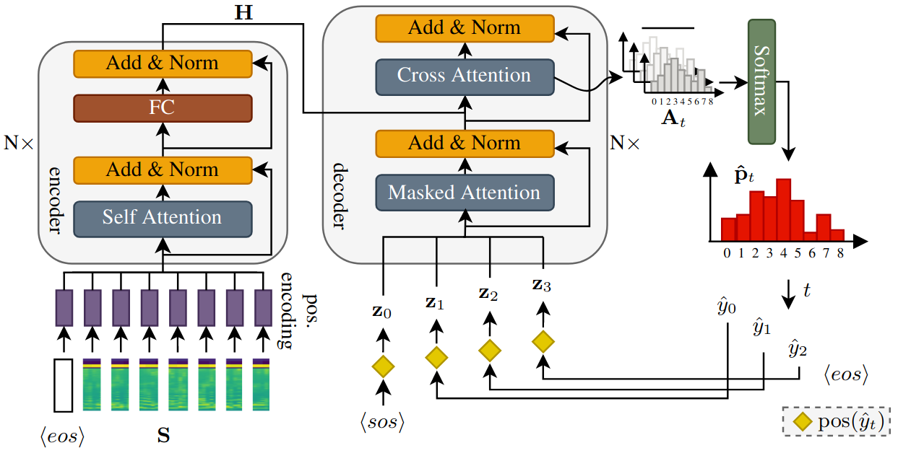

# Point to the Hidden: Exposing Speech Audio Splicing via Signal Pointer Nets
This repository contains the code for the paper 
**Denise Moussa, Germans Hirsch, Sebastian Wankerl, Christian Riess. Point to the Hidden: Exposing Speech Audio Splicing via Signal Pointer Nets**.
published at  [Interspeech 2023](https://interspeech2023.org/). The paper is available [here](https://faui1-files.cs.fau.de/public/publications/mmsec/2023-Moussa-Interspeech.pdf).
If you use this repository for your research, please cite our work as:

```
@inproceedings{moussa23_interspeech,
  author={Denise Moussa and Germans Hirsch and Sebastian Wankerl and Christian Riess},
  title={{Point to the Hidden: Exposing Speech Audio Splicing via Signal Pointer Nets}},
  year=2023,
  booktitle={Proc. INTERSPEECH 2023},
  pages={5057--5061},
  doi={10.21437/Interspeech.2023-996}
}
```




## Prerequisites
- Install [conda](https://docs.conda.io/en/latest/miniconda.html)
- Create the `sigpointer2023` environment with *sigpointer_env.yml*
```bash
$ conda env create -f sigpointer_env.yml
$ conda activate sigpointer2023
```

## Configuration Files
The folder `configs` contains configuration files for models and datasets.

- The model configurations of all neural networks as used in the paper can be found in  `configs/model`.
- The configuration files to generate/load the pickled datasets for the networks are stored in `configs/data`.

More information about the configurable parameters are documented within the provided files.


## Datasets
Download the [test data](https://faui1-files.cs.fau.de/public/mmsec/datasets/sigpointer_audio_splicing_data/)  into the `datasets` folder or custom storage location. Adapt the paths in the data configuration files (`configs/data`) if necessary.
Training data sets are not provided in pickled form due to their size. All data sets from the paper can however be generated with the provided config files and three scripts: 
```bash
$ python 00_prepare_wavs.py
$ python 01_create_dictionaries.py
$ python 02_create_datasets.py
```
We refer to our [previous work](https://faui1-gitlab.cs.fau.de/denise.moussa/audio-splicing-localization) for more information on generating datasets from scratch.

## Pretrained Models
We provide the model weights of the SigPointer runs reported in the paper [here](https://faui1-files.cs.fau.de/public/mmsec/moussa/2023-SigPointer-trained-model-runs/). To load the weights out-of-the-box, use the same storage location `save_model_dir`  as specified in the provided configuration files in `configs/model`.

## Model Training and Prediction
The repository contains training and inference code for the SigPointer model, as well as the Transformer encoder and CNN baselines used in the paper. Use the code of our [previous work](https://faui1-gitlab.cs.fau.de/denise.moussa/audio-splicing-localization)  on audio splicing localization for retraining and evaluating the corresponding Transformer model baseline.

### Transformer-based Models
For SigPointer and the Transformer encoder baseline, model training and prediction generation is done with the script `03a_train_predict.py`.
```bash
$ python 03_train_predict.py
```
The model and dataset config files used for training and inferencing need to be specified in the script. See comments in `03a_train_predict.py` for more information. Model weights and JSON files containing the model predictions will be stored in the directory specified by `save_model_dir` in the respective model config file. 

### CNN Baselines
Use the script `03b_train_predict_cnns.py`  to train/inference the CNN baselines. 

```bash
$ python 03b_train_predict_cnns.py
```
The usage is the same as for `03a_train_predict.py`.

## Model Evaluation
Evaluation metrics are calculated from model predictions with `04_evaluate_results.py`.
```bash
$ python 04_evaluate_results.py
```
This will populate the `outputs` folder with the generated evaluation files. A list of paths to the directories containing the predictions needs to specified in the script. See comments in `04_evaluate_results.py` for more information.
Important: set the `pointer_task` flag to `True` for evaluating SigPointer and to `False` for evaluating the CNN and Transformer classification models. Otherwise the predictions won't be interpreted correctly by the script.

